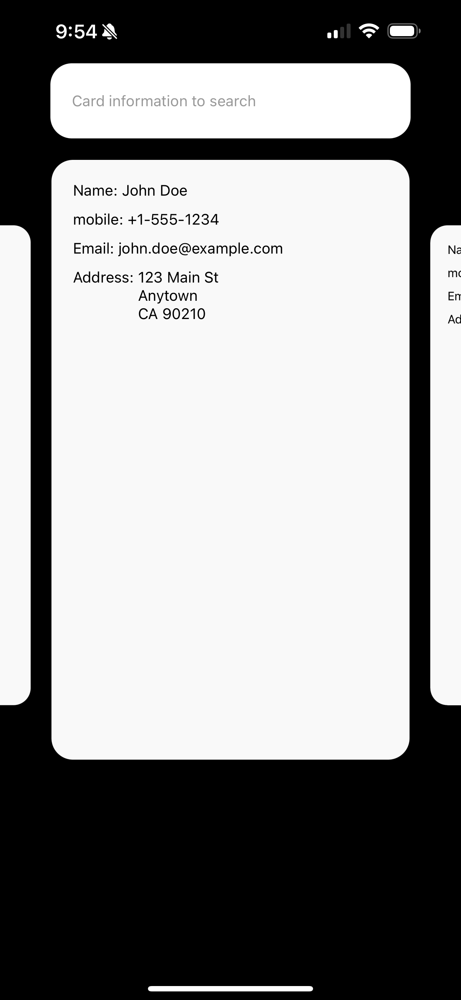

# Welcome

Thank you for your interest in Popl! Here's an overview of the technical assessment process:

1. **Complete the Take-Home Assignment**  
   Follow the instructions provided below to complete the take-home task. This should take about 40 minutes to complete.

2. **Submit Your Work**  
   Once you've finished, please add @gianisalive as contributor, and notify Jorgen by sending an email to [jorgen.phillips@popl.co](mailto:jorgen.phillips@popl.co).

3. **Feedback and Pair Programming**  
   To conclude the technical portion of the interview, we'll schedule a video call to review your assignment together and discuss any potential improvements. In addition, you may also choose to showcase a personal project that you're proud of if we have remaining time.

__Side note__: You can either build for iOS or Android. If you choose to build for iOS, please use your own Apple Developer Account to make sure the project compiles. 

## Task 1 - Render User Data in a Carousel

Render all the example data into individual carousel components. The example data, `data.json`, is already imported into `App.tsx`.

## Task 2 - Implement Search

Allow the user to search by name or address. If a user is found, display only the matching user(s) in the carousel.

## Side Note

Keep it simple 🙂 We'll chat more in depth during our video call if you have any questions, feel free to reach out to us.
